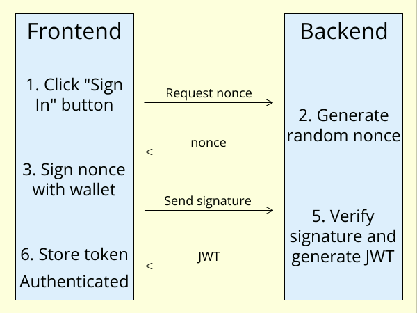

# Web3 Authentication
The app demonstrates wallet-based authentication. The user can access their data stored in the database ("off-chain") by signing the message with his private key.

## Technologies & Tools
- MERN stack (MongoDB, Express, React, NodeJS)
- Typescript
- EthereumJS
- JSON Web Token
- Vite, Nodemon

## Authentication flow

## Setting Up
1. Clone/Download.
2. Install dependencies for frontend and backend using `npm install`.
3. Create .env for backend specifying MONGO_CONNECTION_STRING.
4. Run backend with `npm start`.
5. Run frontend with `npm run dev` and open [http://localhost:5173](http://localhost:5173) to view project in your browser.